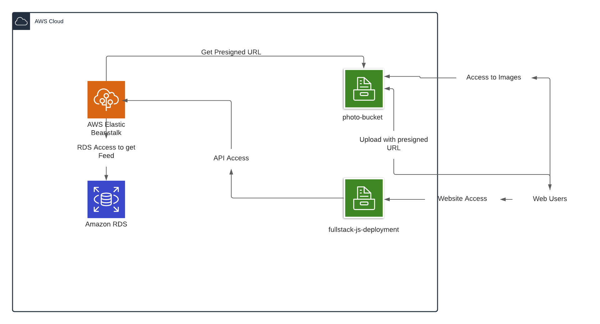

# Infrastructure

You can find the infrastructure diagram in the screenshots folder.

When a user connect to the website, they request all the static content from s3 bucket. Afterwards since the feed is public and it is the first page, they make a request to the api which gets the feed from RDS and maps the images to a secondary bucket. In this way the user can see the feed. 

The user can register (you can use user, test@gmail.com with password test to test it), and upload photos. To upload photos, the request is made first to Elastic Beanstalk API server and api server with its credentials gets a presigned url for the user. The user can use this url to upload the image with temporary access.

You can access the website via [http://fullstack-js-deployment.s3-website.eu-central-1.amazonaws.com/](http://fullstack-js-deployment.s3-website.eu-central-1.amazonaws.com/)